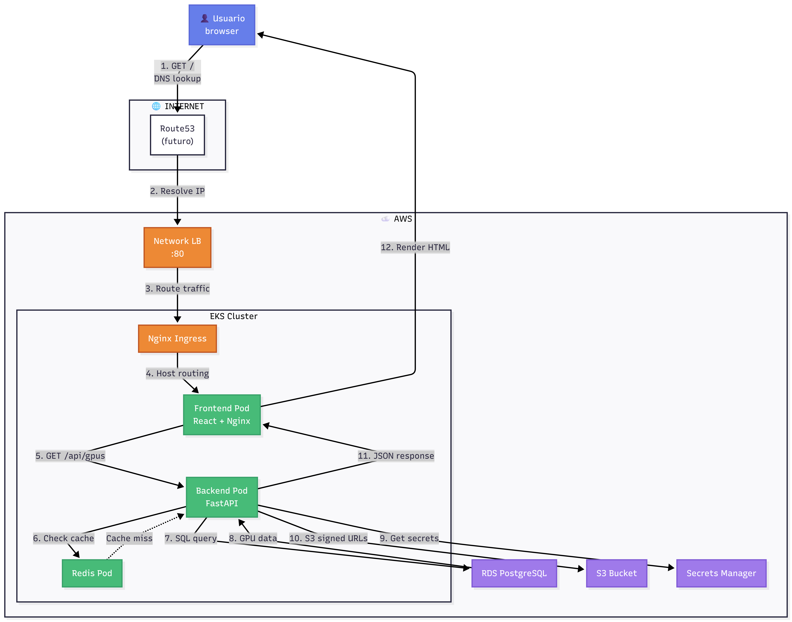
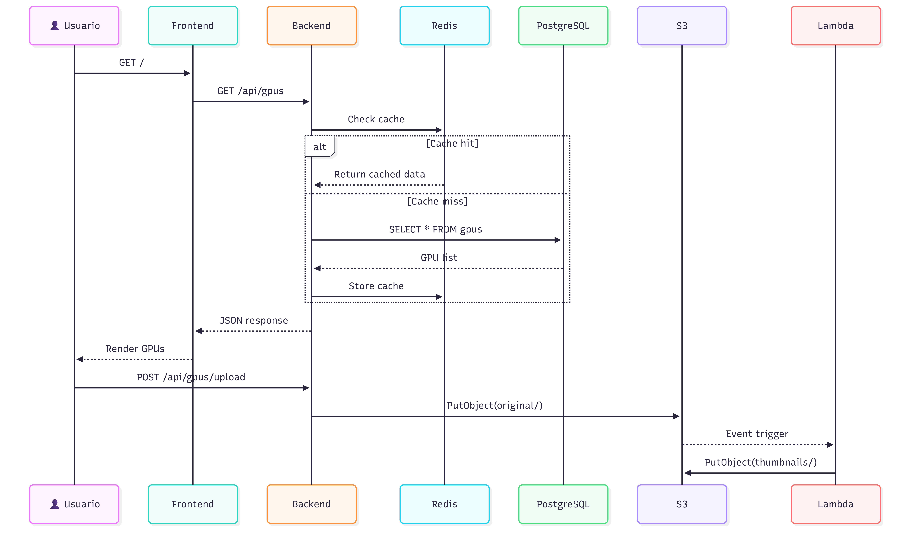
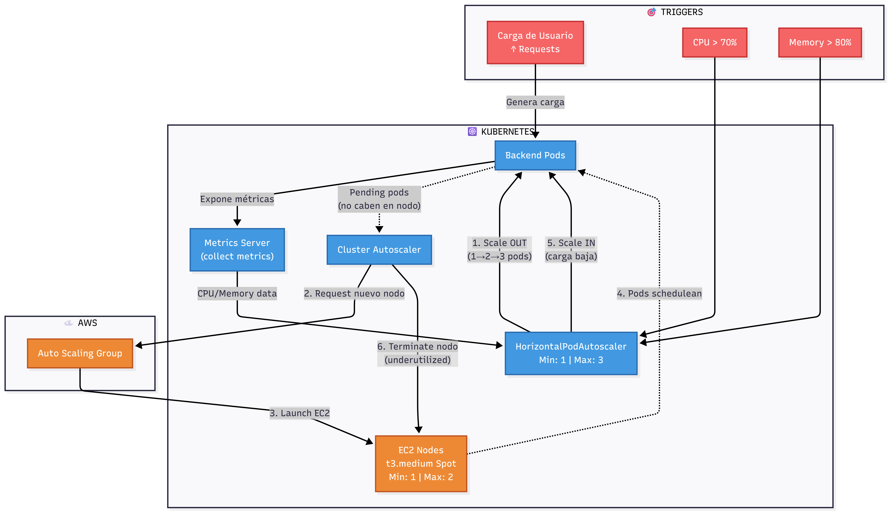

# GpuChile - Arquitectura Cloud-Native en AWS EKS con IA Generativa

[](https://www.terraform.io/)
[](https://kubernetes.io/)
[](https://aws.amazon.com/)
[](https://fastapi.tiangolo.com/)
[](https://reactjs.org/)
[](https://www.postgresql.org/)

Plataforma de e-commerce especializada en hardware GPU con capacidades de búsqueda semántica mediante IA generativa. Implementación production-grade sobre AWS EKS con arquitectura cloud-native, observabilidad completa y gestión de secretos sin credenciales hardcodeadas.



---

## Problema y Solución

**Desafío Técnico**: Construir una arquitectura escalable de microservicios sobre Kubernetes que integre capacidades de IA generativa (LLM + RAG) con búsqueda vectorial, manteniendo costos controlados y cumpliendo estándares de producción (observabilidad, security-first, CI/CD automatizado).

**Solución Implementada**:
- Clúster EKS 1.31 con autoscaling horizontal (HPA) y vertical (Cluster Autoscaler) usando instancias Spot para reducir costos en 70%
- Base de datos híbrida (PostgreSQL + pgvector) para persistencia relacional y búsqueda semántica con latencias sub-milisegundo
- Gateway de IA con modelo Llama-3 (70B) orquestado mediante Groq Cloud para inferencia remota de baja latencia
- Pipeline CI/CD completamente automatizado con GitHub Actions y OIDC (sin AWS keys estáticas)
- Stack de observabilidad (Prometheus + Grafana) con retención persistente en volúmenes EBS gp3
- Gestión de secretos mediante External Secrets Operator sincronizado con AWS Secrets Manager

**Diferenciadores**:
- Integración IA/ML con Retrieval-Augmented Generation (RAG) y embeddings vectoriales almacenados en RDS
- Arquitectura event-driven con Lambda para procesamiento asíncrono de imágenes (Convention over Configuration para evitar NAT Gateway)
- IRSA (IAM Roles for Service Accounts) eliminando credenciales hardcodeadas en pods
- Self-healing automático con reconciliation loops nativos de Kubernetes (ReplicaSets + Service Discovery)

---

## Arquitectura del Sistema

### Capa de Networking

El sistema despliega una VPC multi-AZ (10.0.0.0/16) con segregación de tráfico mediante subnets públicas y privadas. Los nodos worker de EKS residen en subnets privadas con acceso directo a internet mediante mapeo de IPs públicas (evitando NAT Gateway para reducir costos).


**Decisión de diseño**: Single-AZ para RDS PostgreSQL reduce costos en 50% mientras mantiene backups automáticos (RPO: 24h). En producción crítica se recomendaría Multi-AZ con failover automático (RTO: <15 min).

### Flujo de Datos End-to-End

El tráfico de usuario atraviesa un Network Load Balancer que enruta requests al Nginx Ingress Controller dentro del clúster. El frontend (React + Nginx) sirve assets estáticos y actúa como proxy reverso hacia el backend FastAPI, que implementa lógica de negocio con caching Redis y persistencia PostgreSQL.



**Componentes críticos**:
- **Frontend**: React SPA empaquetado en contenedor Nginx con proxy reverso a backend mediante DNS interno de Kubernetes (`gpuchile-backend.default.svc.cluster.local:8000`)
- **Backend**: FastAPI con Uvicorn expone endpoints RESTful para CRUD, autenticación JWT, procesamiento de imágenes S3 y gateway LLM
- **Cache Layer**: Redis en pod standalone (consideración: Redis Cluster para producción high-traffic)
- **Persistencia**: RDS PostgreSQL 15.4 con extensión pgvector v0.8.0 para almacenamiento híbrido (datos estructurados + embeddings vectoriales)

---

## Kubernetes: Autoscaling y Alta Disponibilidad

La arquitectura implementa redundancia horizontal mediante ReplicaSets gestionados por Deployments. El backend escala dinámicamente entre 1-3 réplicas basado en utilización de CPU (>70%), mientras que el Cluster Autoscaler gestiona el aprovisionamiento de nodos EC2 Spot cuando los pods entran en estado `Pending`.



### Validación de Nodos Multi-AZ

```bash
$ kubectl get nodes -o wide

NAME                          STATUS   ROLES    AGE    VERSION               INTERNAL-IP    OS-IMAGE
ip-10-0-1-127.ec2.internal    Ready    <none>   3d1h   v1.29.15-eks-ecaa3a6  10.0.1.127     Amazon Linux 2
ip-10-0-1-64.ec2.internal     Ready    <none>   3h57m  v1.29.15-eks-ecaa3a6  10.0.1.64      Amazon Linux 2
ip-10-0-2-168.ec2.internal    Ready    <none>   43m    v1.29.15-eks-ecaa3a6  10.0.2.168     Amazon Linux 2
ip-10-0-2-205.ec2.internal    Ready    <none>   3d1h   v1.29.15-eks-ecaa3a6  10.0.2.205     Amazon Linux 2
```
Los nodos se distribuyen entre subnets privadas de diferentes AZs (us-east-1a, us-east-1b), garantizando tolerancia a fallos zonales.

Kubernetes Nodes

Mecanismo de Self-Healing
El sistema implementa recuperación automática mediante el ciclo de reconciliación nativo de Kubernetes:

Detección: El Kubelet detecta fallo del contenedor (ej: OOMKilled, CrashLoopBackOff)

Aislamiento: El pod se marca como NotReady y el Service deja de enrutar tráfico inmediatamente

Recuperación: El ReplicaSet detecta discrepancia entre estado actual (1/2 pods) y deseado (2/2) y crea pod de reemplazo

Restauración: El nuevo pod pasa health checks (/health, /readyz) y se reintegra al balanceo de carga

Resultado: Zero downtime para usuarios finales con recuperación en milisegundos sin intervención manual.

Integración IA/ML: RAG con Llama-3 y pgvector
Gateway Inteligente con LLM
El sistema expone un endpoint /api/v1/ask-ai que actúa como gateway para consultas en lenguaje natural. La implementación orquesta llamadas a la API de Groq Cloud utilizando el modelo llama-3.3-70b-versatile, optimizado para baja latencia en inferencia.

AI Gateway Llama-3

Flujo de procesamiento:

El usuario envía query conversacional ("GPU para 4K gaming bajo $1000")

El backend genera embeddings del query usando SentenceTransformers

Se ejecuta búsqueda de similitud coseno en PostgreSQL mediante operador <=> de pgvector

Los productos recuperados se inyectan como contexto al prompt de Llama-3

El LLM genera respuesta personalizada con recomendaciones técnicas

Búsqueda Semántica con pgvector
La extensión pgvector v0.8.0 habilita almacenamiento de vectores de alta dimensión (768D) en la misma tabla que datos estructurados, eliminando la necesidad de bases de datos vectoriales especializadas.

Persistencia Hibrida RDS

Ventajas técnicas:

Indexación HNSW: Algoritmo de grafos que permite búsquedas ANN (Approximate Nearest Neighbors) con latencia de milisegundos, superando a índices IVFFlat tradicionales

Escalabilidad: Preparado para millones de vectores sin degradación de rendimiento

Transaccionalidad: Embeddings y datos relacionales en mismo transaction scope (ACID compliant)

Motor Vectorial pgvector

Graceful Fallback y UX Conversacional
El sistema implementa intent detection y fallback inteligente. Cuando el motor RAG no encuentra productos que coincidan con el presupuesto del usuario, el LLM utiliza su conocimiento pre-entrenado para recomendar hardware estándar del mercado y sugerir explorar el catálogo completo.

Query Semantica AI Reasoning

Observabilidad: El campo "observability": "tracked_by_agentops" confirma monitoreo de prompts, métricas de tokens y análisis de costos para auditoría.

Security & Secrets Management
IRSA (IAM Roles for Service Accounts)
Los pods de backend obtienen permisos de AWS sin credenciales estáticas mediante AssumeRoleWithWebIdentity. El ServiceAccount tiene anotación con ARN del rol IAM, y el OIDC Provider de EKS valida tokens JWT para emitir credenciales temporales.

Security Secrets Flow

Ventajas:

Eliminación de AWS Access Keys hardcodeadas en variables de entorno

Rotación automática de credenciales (tokens de corta duración)

Principio de menor privilegio (cada ServiceAccount tiene rol específico para S3, Secrets Manager, etc.)

External Secrets Operator
Los secretos se almacenan en AWS Secrets Manager y se sincronizan automáticamente cada 1 hora al clúster como objetos Secret nativos de Kubernetes. El backend los consume como variables de entorno sin conocer su origen.

Secretos gestionados:

gpuchile/dev/db: Credenciales de PostgreSQL (username, password, host, port)

gpuchile/dev/jwt: Secret para firma de tokens de autenticación

gpuchile/dev/redis: URL de conexión a Redis

Observabilidad Production-Grade
Stack Prometheus + Grafana
El clúster despliega kube-prometheus-stack via Helm con almacenamiento persistente EBS gp3 (evitando pérdida de métricas históricas en reinicio de pods). Prometheus scraping targets incluyen:

Kubelet metrics (CPU, memoria, disco por nodo)

Backend /metrics endpoint (request count, latency p95/p99, error rate)

Redis exporter (hit rate, evicted keys, conexiones activas)

Monitoring Stack

Dashboard Node Exporter
El dashboard muestra consumo de recursos en tiempo real. La captura evidencia RAM estable (~43%) y baja latencia de red, indicando dimensionamiento correcto del clúster sin overprovisioning.

Dashboard Grafana

Nota técnica: Los volúmenes persistentes están en estado Bound exitosamente mediante AWS EBS CSI Driver, confirmando retención de datos históricos.

Health Checks Deep
A diferencia de un simple ping, el endpoint /health valida conectividad con dependencias críticas antes de reportar estado al Load Balancer:

Health Checks

Componentes verificados:

PostgreSQL: Latencia de escritura y disponibilidad de conexiones del pool

Redis: Comando PING para confirmar caché operativo

Versioning: Expone versión del despliegue (v7.0.0) y timestamp para trazabilidad de releases

El Load Balancer solo enruta tráfico a pods que responden HTTP 200, implementando health-based routing.

CI/CD Pipeline Automatizado
GitHub Actions con OIDC
El pipeline elimina AWS Access Keys estáticas usando OIDC federation entre GitHub y AWS. El workflow obtiene credenciales temporales de STS y ejecuta:

Build de imagen Docker

Push a Amazon ECR

Rolling update en EKS via kubectl set image

Health check post-deployment

CI/CD Pipeline

Trigger: Push a branch main en carpetas apps/backend o apps/frontend

Validación de Deployment
El workflow incluye smoke tests que verifican disponibilidad de endpoints críticos post-deploy:

- name: Verify deployment status
  run: kubectl rollout status deployment/gpuchile-backend -n default --timeout=180s

- name: Health check
  run: curl --fail --retry 3 http://backend-loadbalancer/health

Infrastructure as Code
Estructura Modular de Terraform
El proyecto implementa separación de responsabilidades mediante módulos reutilizables:
terraform/
├── 1-infrastructure/       # Capa base (VPC, EKS, RDS, S3)
│   └── modules/
│       ├── vpc/
│       ├── eks/
│       ├── rds/
│       ├── s3/
│       └── lambda/
├── 2-applications/         # Capa de aplicaciones (Helm controllers, IRSA)
│   └── modules/
│       ├── helm-controllers/
│       ├── monitoring/
│       └── irsa/
└── environments/
    ├── dev/
    └── prod/

State Management
Terraform gestiona 85+ recursos distribuidos entre servicios de AWS y configuraciones de Kubernetes:

Terraform State

Validación de Infraestructura
RDS PostgreSQL en estado disponible:

$ aws rds describe-db-instances --query "DBInstances.{DB:DBInstanceIdentifier,Endpoint:Endpoint.Address,Status:DBInstanceStatus}"

{
    "DB": "gpuchile-dev",
    "Endpoint": "gpuchile-dev.cifci8iac1cw.us-east-1.rds.amazonaws.com",
    "Status": "available"
}

RDS Validation

S3 Bucket para almacenamiento de imágenes:
$ aws s3 ls | Select-String "gpuchile-images"
2026-02-12 19:58:09 gpuchile-images-dev-592451843842

S3 Bucket

Network Load Balancer aprovisionado:

Load Balancer

Características de Producción
Data Seeding Idempotente
El sistema implementa un Job de Kubernetes que ejecuta un script Python/SQLAlchemy para inicialización de datos. El script verifica existencia de registros antes de insertar, evitando duplicados en re-despliegues.

Data Seeding

Implementaciones clave:

Sanitización de datos: Patrón Whitelist para filtrar payloads JSON inconsistentes

Logging estructurado: Salida estandarizada [INFO]/[SUCCESS] para observabilidad en CloudWatch/FluentBit

Conexión segura: El Job obtiene credenciales de RDS desde Secrets Manager vía External Secrets

API RESTful Completa
El backend expone endpoints estandarizados para gestión de inventario con validación estricta de esquemas mediante Pydantic:

CRUD Endpoints

Operaciones implementadas:

GET /api/gpus: Listado con paginación y filtros por marca/precio/VRAM

POST /api/gpus: Creación con validación de campos obligatorios (price > 0, stock >= 0)

PUT /api/gpus/{id}: Actualización parcial (PATCH-like behavior)

DELETE /api/gpus/{id}: Soft delete (flag is_active=false)

Servicios Auxiliares
AI Media Monitoring Services

Endpoints adicionales:

/api/auth/register, /api/auth/login: Autenticación JWT con bcrypt para passwords

/api/cart: Lógica de carrito persistente con validación de stock en tiempo real

/api/images/upload: Carga a S3 con presigned URLs (evitando proxy de archivos grandes por backend)

/healthz, /readyz: Probes de Kubernetes para liveness y readiness

/metrics: Exposición de métricas Prometheus (request count, latency histograms)

Interfaz de Usuario Integrada
La aplicación desplegada en EKS muestra integración completa del sistema:

Frontend en EKS

Funcionalidades:

Catálogo dinámico con imágenes servidas desde S3 (CloudFront pendiente para CDN)

Chatbot impulsado por Llama-3 con entendimiento de lenguaje natural

Indicador de salud del sistema (RDS: CONNECTED)

Stack Tecnológico
Compute & Orchestration

| Componente        | Tecnología               | Versión                         |
| ----------------- | ------------------------ | ------------------------------- |
| Orchestrator      | Amazon EKS               | 1.31                            |
| Container Runtime | containerd               | 1.7                             |
| Node OS           | Amazon Linux 2           | 5.10.245                        |
| Instance Type     | EC2 Spot t3.medium       | 2 vCPU, 4GB RAM                 |
| Autoscaling       | HPA + Cluster Autoscaler | Min: 1, Max: 3 pods / 1-2 nodes |

Data & Storage

| Componente       | Tecnología     | Versión               |
| ---------------- | -------------- | --------------------- |
| Database         | RDS PostgreSQL | 15.4                  |
| Vector Extension | pgvector       | 0.8.0 (HNSW indexing) |
| Cache            | Redis          | 7-alpine              |
| Object Storage   | Amazon S3      | Standard class        |
| Volumes          | EBS gp3        | CSI Driver 1.25       |

Networking & Security

| Componente    | Tecnología                | Configuración        |
| ------------- | ------------------------- | -------------------- |
| VPC           | AWS VPC                   | 10.0.0.0/16 multi-AZ |
| Load Balancer | Network LB                | Layer 4 TCP routing  |
| Ingress       | Nginx Ingress Controller  | Kubernetes native    |
| Secrets       | AWS Secrets Manager + ESO | Sync interval: 1h    |
| IAM           | IRSA                      | OIDC federation      |

Observability & CI/CD

| Componente    | Tecnología          | Configuración             |
| ------------- | ------------------- | ------------------------- |
| Metrics       | Prometheus Operator | Retention: 7d persistent  |
| Visualization | Grafana             | Pre-configured dashboards |
| Logs          | Fluent Bit          | CloudWatch sink           |
| CI/CD         | GitHub Actions      | OIDC authentication       |
| Registry      | Amazon ECR          | Private repositories      |

Application Stack

| Componente         | Tecnología             | Versión          |
| ------------------ | ---------------------- | ---------------- |
| Backend Framework  | FastAPI + Uvicorn      | 0.109.0          |
| Frontend Framework | React + Vite           | 18.2             |
| Web Server         | Nginx                  | 1.25-alpine      |
| ORM                | SQLAlchemy             | 2.0.25           |
| AI/ML              | Llama-3 (70B) via Groq | Cloud inference  |
| Embeddings         | SentenceTransformers   | all-MiniLM-L6-v2 |

Infrastructure as Code

| Componente        | Tecnología           | Versión   |
| ----------------- | -------------------- | --------- |
| IaC               | Terraform            | 1.6.0+    |
| Kubernetes Config | Helm Charts          | 3.12+     |
| State Backend     | Terraform S3 Backend | Encrypted |

Despliegue Rápido
Prerequisitos
AWS CLI configurado con credenciales (Access Key con permisos AdministratorAccess para provisioning inicial)

Terraform >= 1.6.0

kubectl >= 1.28

Helm >= 3.12

Docker (opcional, para builds locales)
Paso 1: Provisionar Infraestructura

cd terraform/1-infrastructure
terraform init
terraform plan -out=plan.tfplan
terraform apply plan.tfplan

Tiempo estimado: 15-20 minutos (creación de EKS Control Plane es el cuello de botella)
Paso 2: Configurar kubectl

aws eks update-kubeconfig --name gpuchile-cluster --region us-east-1
kubectl get nodes  # Verificar conectividad

Paso 3: Instalar Controladores Helm

cd ../2-applications
terraform init
terraform apply

Esto despliega:
-AWS Load Balancer Controller
-External Secrets Operator
-Prometheus Operator
-Metrics Server

Paso 4: Desplegar Aplicaciones

# Instalar Redis
kubectl apply -f ../../kubernetes/redis/

# Desplegar backend
helm install gpuchile-backend ../../helm/backend --namespace default

# Desplegar frontend
helm install gpuchile-frontend ../../helm/frontend --namespace default

Paso 5: Obtener URL de Acceso
kubectl get svc gpuchile-frontend -n default -o jsonpath='{.status.loadBalancer.ingress.hostname}'
La aplicación estará disponible en el hostname del Load Balancer (ejemplo: a8f3d21...elb.amazonaws.com).

Verificación
# Health del backend
curl http://<backend-lb-url>/health

# Endpoints disponibles
curl http://<backend-lb-url>/docs

# Métricas de Prometheus
kubectl port-forward -n monitoring svc/prometheus-stack-kube-prom-prometheus 9090:9090

# Grafana (user: admin, pass: admin123)
kubectl port-forward -n monitoring svc/prometheus-stack-grafana 3000:80

Arquitectura de Decisiones (ADRs)
ADR-001: EC2 Spot en lugar de On-Demand
Contexto: Necesidad de reducir costos sin comprometer disponibilidad.

Decisión: Usar instancias Spot con interruption handling automático via Cluster Autoscaler.

Consecuencias:

Pros: 70% de ahorro, diversificación en múltiples tipos de instancia (t3.medium, t3a.medium)

Contras: Interrupción ocasional con 2 min notice (manejado por k8s graceful shutdown)

ADR-002: Lambda sin VPC (Convention over Configuration)
Contexto: Lambda necesita escribir URL de thumbnail en RDS requeriría NAT Gateway.

Decisión: Lambda no escribe en DB. Backend construye URLs por convención (s3://.../original/image.jpg → s3://.../thumbnails/image.jpg).

Consecuencias:

Pros: Costo reducido, Lambda stateless e idempotente, desacoplamiento

Contras: Requiere naming convention documentada, no soporta múltiples tamaños de thumbnail con nombres custom

ADR-003: pgvector en RDS en lugar de Pinecone/Weaviate
Contexto: Necesidad de búsqueda vectorial sin gestionar infraestructura adicional.

Decisión: Usar extensión pgvector en PostgreSQL existente.

Consecuencias:

Pros: Datos relacionales y vectores en misma transacción (ACID), sin servicio adicional

Contras: Performance inferior a bases vectoriales especializadas a >1M vectores (suficiente para MVP)

Contacto y Autor
Nicolás Núñez Álvarez
Ingeniero en Conectividad y Redes
Santiago, Chile

GitHub: @NicolasNunez05

LinkedIn: nicolas-nunez-alvarez

Email: nicolasnunezalvarez05@gmail.com

Licencia
Este proyecto está bajo licencia MIT. Ver archivo LICENSE para detalles.


